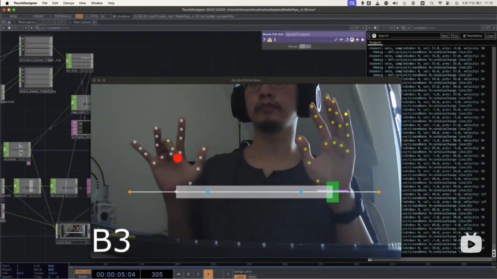
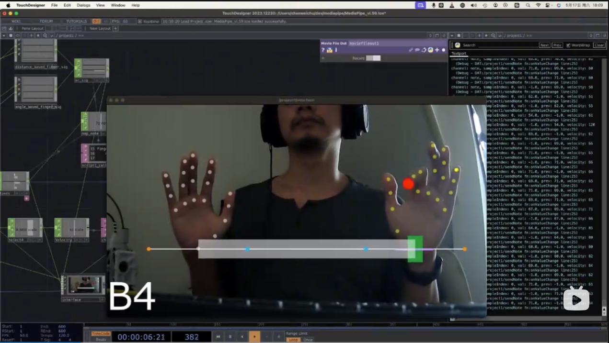
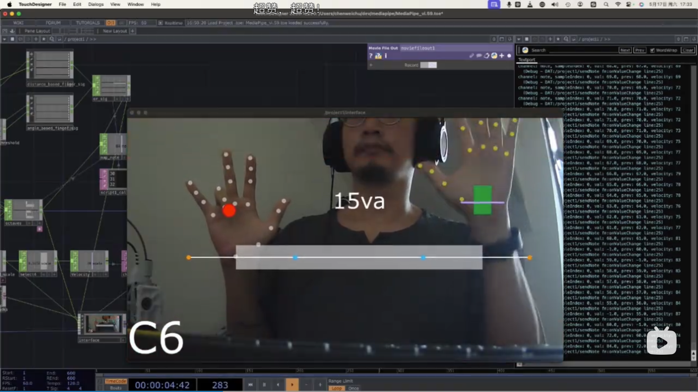
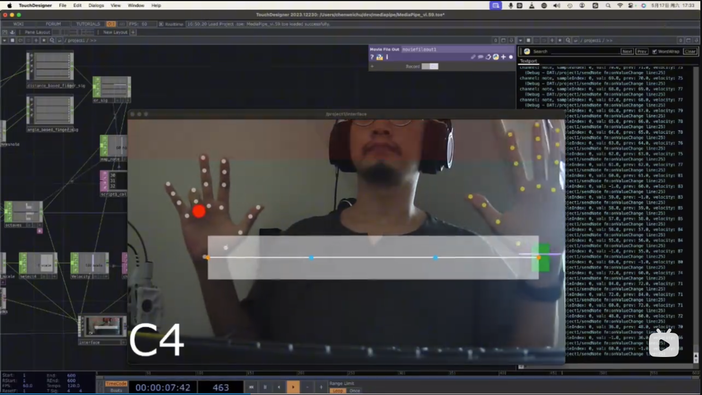

# Gesture Instrument in TouchDesigner (MediaPipe)

> 一个在 **TouchDesigner** 里实现的“空气乐器 / 手势乐器”原型：用 **MediaPipe 手部识别**获取双手与十指的姿态数据，把它映射为**音高 / 力度 / 八度**等演奏参数，用于验证“纯视觉手势输入是否能达到乐器级交互”的可行性。

**核心点：**  
- **十指弯曲** → 控制一个八度内的**十二平均律半音**（Chromatic）  
- **左右手高度差（Y）** → **升/降八度**  
- **双手水平距离（X）** → **力度 / Velocity**  
- UI 实时显示：当前力度、当前八度、当前音符，并带有若干演奏提示标记  

**局限性：**  
- **没有实体触感反馈**：节奏与力度控制很难“落点”
- **视觉识别抖动不可避免**：手部关键点会跳动，尤其在边缘光照/快速运动时
- **为了稳定性加入的延迟**：抖动↓，但可控性↓（尤其对节奏）

结论：现阶段视觉手势识别的稳定性距离“乐器级输入设备”仍有差距，本项目的价值更多在于**验证映射与交互模型**。

---

## Demo Video（视频演示）

- 视频链接：[B站](https://www.bilibili.com/video/BV1CTJNzQEk4)

- 部分截图：

---

## How it works

本项目主要由两部分组成：

1. **手势识别 / Hand Tracking**  
   - 基于 Google **MediaPipe** 的手部追踪能力  
   - 在 TouchDesigner 中通过 torinmb 的插件工程进行集成：`mediapipe-touchdesigner` (https://github.com/torinmb/mediapipe-touchdesigner)

2. **乐器交互逻辑 / Instrument Logic（本仓库的重点）**  
   - 一部分用 TouchDesigner 节点网络实现（可视化编程）  
   - 一部分用 Python 实现（音符计算、映射、抗抖/延迟等）

---

## Controls（交互映射）

| 输入（视觉手势） | 参数 | 含义 |
|---|---|---|
| 十个手指的弯曲程度 | Note / Pitch Class | 映射到一个八度内的 12 个半音（Chromatic） |
| 左右手高度差（Y） | Octave Shift | 升/降八度（整数档位） |
| 双手水平距离（X） | Velocity / Gain | 控制力度（强弱） |

> 设计目标是“逻辑直观”：你看得懂映射关系；但实际演奏会很难（缺少触感反馈 + 识别抖动/延迟）。

---

## Requirements

- TouchDesigner（建议使用与你所克隆的 `mediapipe-touchdesigner` 兼容的版本）
- 摄像头（画质与帧率越高越好）
- 运行环境：macOS / Windows（取决于 TouchDesigner 与插件支持情况）
- 可选：VST 音源（本项目演示使用了一个免费 VST 音源；你也可以替换为任意 TD 可用的音源/合成方案）

---

## Credits

- Google **MediaPipe**（Hand Tracking）
- Torin Blankensmith 的 TouchDesigner MediaPipe 插件工程：`torinmb/mediapipe-touchdesigner`  
  https://github.com/torinmb/mediapipe-touchdesigner
- 音源：演示使用免费 VST（你可以替换为任何可用音源/合成方案）

---

## License

本项目采用 MIT 许可证发布，详见 [LICENSE](LICENSE)。

---